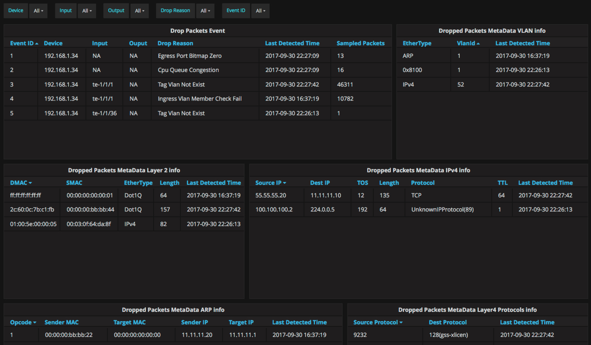

# collector

This sdrop collector is based grafana, use grafana as the user interface to present the information.

- directory agent contain the agent of sdrop, which parse the packet and add it to database.
- directory ui contain the dashboard configuration of grafana.

grafana is a powerful frontend to represent metric, it supports all kinds of datasource, we use mysql to hold all the information.

Below is UI of the sdrop collector.

