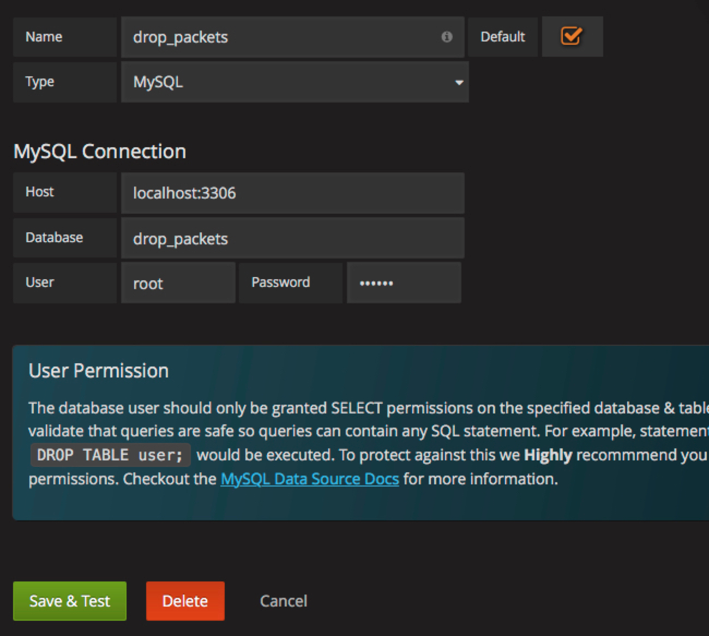
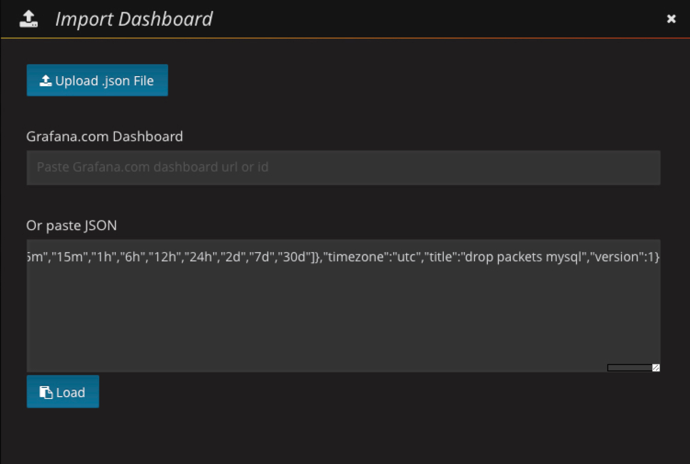
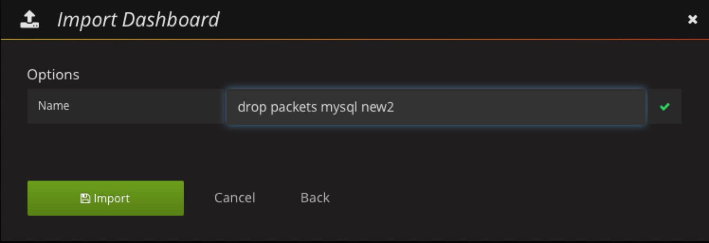

# User Interface

This collector uses grafana as the present UI, grafana is a powerful frontend for metric presentation, so we just provide the grafana dashboard configuration json file.

## Add Data Source

we use mysql as it data source.

## Import DashBoard

### paste json configuration

Note that the json paste into input field must be unformatted.

### give a new name

