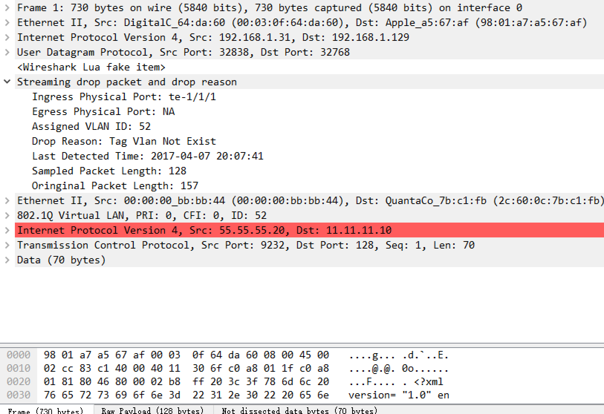

# sDrop wireshark plugin

- sdrop.lua is wireshark plugin that could display the exported sdrop packet.
- tag\_vlan\_not\_exist.pcap contain the exported sdrop packet 

## Usage of plugin
- Put the lua plugin into the direcotry of wireshark plugin. <br>
- Find the init.lua file, add the line below <br>
```
dofile(sdrop.lua)
```
<br>or<br>
```
dofile(DATA_DIR.."sdrop.lua")
```
<br>
With the first way, you don't need to put the sdrop.lua into to DATA_DIR, you can just put in the same directory with the pcap files.<br>
- Note that the current plugin assume you use the default udp dest port (32768), if you use other, change it accordingly.

## Example of plugin

- Below is the screenshot of the tag vlan not exist drop exported packet




