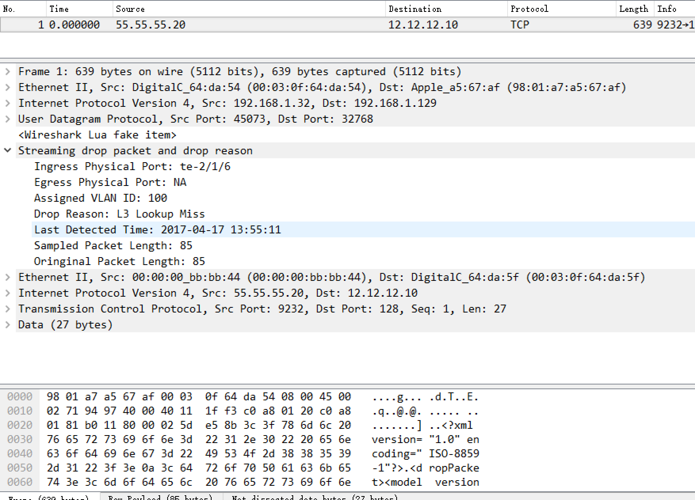

# sDrop wireshark plugin

- sdrop.lua is wireshark plugin that could display the exported sdrop packet.
- tag\_vlan\_not\_exist.pcap contain the exported sdrop packet that the original packet drop due to vlan not created. 
- l3\_lookup\_miss.pcap contain the exported sdrop packet that the orignial packet drop due to l3 lookup missed.

## Usage of plugin
- Put the lua plugin into the direcotry of wireshark plugin. <br>
- Find the init.lua file, add the line below.<br>
    ```
    dofile(sdrop.lua)
    ```
    or<br>
    ```
    dofile(DATA_DIR.."sdrop.lua")  
    ```
    With the first way, you don't need to put the sdrop.lua into to DATA_DIR, you can just put in the same directory with the pcap files.<br>
- Note that the current plugin assume you use the default udp dest port (32768), if you use other, change it accordingly.<br>

## Example of plugin

- Below is the screenshot of the tag vlan not exist drop exported packet


- Below is the screenshot of the l3 lookup miss drop exported packet




